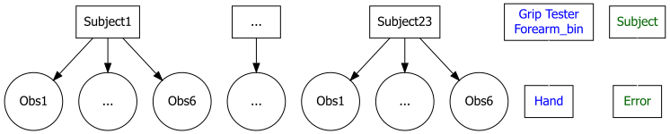
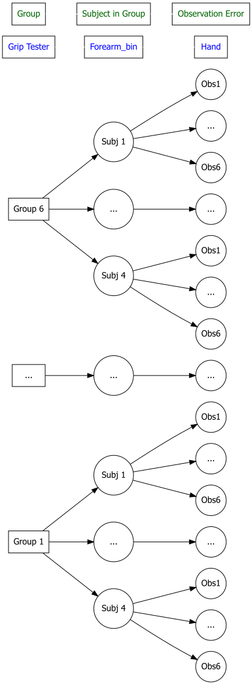

```{r setup, include=FALSE}
knitr::opts_chunk$set(message = FALSE,
                      warning = FALSE)
options(show.signif.stars = FALSE)

library(ggplot2)
library(ggthemes)
library(tidyverse)
library(car)
library(effects)
library(readxl)
library(mosaic)
library(catstats2)
library(ggResidpanel)
library(easyalluvial)
library(emmeans)
library(patchwork)
library(plotly)
library(lme4)
library(lmerTest)
library(gtsummary)
library(qqplotr)
library(DiagrammeR)
library(DiagrammeRsvg)
library(MuMIn)
webshot::install_phantomjs(force = T)
theme_set(theme_bw()) #Prevents need for + theme_bw() in ggplots
```

```{r}
GripStrengthMeasurements <- read_excel("GripStrengthMeasurementsF24.xlsx")
GS <- GripStrengthMeasurements %>% drop_na(GripStrength)
GS <- GS %>% drop_na(Arm)
GS <- GS %>% mutate(Arm = forcats::fct_collapse(Arm,
                                                Up = c("Up", "up"),
                                                Down = c("Down", "down"),
                                                "90" = c("90", "90 degree")),
                    SubjectID = forcats::fct_collapse(SubjectID,
                                          MDEarl = c("MDEarl","MDEar")),
                    Arm = factor(Arm),
                    Hand = factor(Hand),
                    OrderF = factor(Order)
)

Demographics <- read_excel("DemographicsF24.xlsx")
Demographics <- Demographics %>% mutate(SubjectID = forcats::fct_recode(SubjectID,
                                                              LADeathGrips = "LADeath"))

Demographics <- Demographics %>% mutate(Weights = factor(Weights), 
                                        Weights = forcats::fct_collapse(Weights,
                                                              no = c("no", "No"),
                                                              yes = c("yes", "Yes")))

combined <- left_join(x = GS, y = Demographics, by = "SubjectID")

combinedR <- combined %>% drop_na()

combinedR <- combinedR %>% mutate(forearm_bins   = cut_number(ForearmLength, n = 3),
                                  epworth_bins = cut_number(Epworth, n = 3),
                                  balance_bins = cut_number(BalanceTime, n = 3))


```


**1) Now we can incorporate which grip tester was used to take the measurements, which we will treat as a fixed effect. Modify the provided sentence to report an evidence sentence for the grip tester in the following model.**


```{r}
lmer2 <- lmer(GripStrength ~ forearm_bins + GripTesterID + Hand +  (1|SubjectID), data = combinedR)
Anova(lmer2, test.statistic = "F")
plot(allEffects(lmer2), grid = T)
```

* There is moderate evidence against the null hypothesis of no difference among the grip testers on grip strength (F(4, 16.009) = 2.997, p-value = 0.0504) controlled for subject, forearm length, and hand, so we would conclude that there [is/is not] a difference based on grip tester and keep it in the model.


## Summarizing/exploring mixed models:

In mixed models, the random effect variances create some extra opportunities and challenges when trying to summarize the model.

First, the random effects can be used to calculate the intra-class correlation (ICC) as discussed on page 16 of the Chapter 14 Part II notes.

**2) For the model `lmer2`, report the estimated subject variance and estimated residual variance.**

```{r}
summary(lmer2)
```

* $\hat{\sigma}_{subject}^2 = 136.94$

* $\hat{\sigma}_{\epsilon}^2 = 23.33$


**3) Use the two variances to calculate the estimated ICC. Show your work.**

136.66 / 136.66 + 23.33

* Estimated ICC = 0.85


**4) Interpret the ICC result in a sentence as you would in a report and then write a sentence to discuss what this suggests about repeated measures on grip strength (something about what the ICC suggests).**

Once we account for grip tester, dominant/ non D hand, and forearm length, the estimated correlation of two grip strength measurements in 0.85. This indicates high correlation between two observations once we account for systematic changes across subjects. 


**5) We can also explore the estimates for each subject on the random subject effect. These are not to be used to do inferences for differences, but we can qualitatively explore the variability. You can print out the subject random effect estimates using `ranef(modelname)` or you can plot the results with estimates of the uncertainty using `dotplot(ranef(modelname, postVar = T))` or  you can make a QQ-plot to use for assessing normality of a single random effect using the provided code. _Fix the title on the QQ-plot_, then find a subject of interest to you in the caterpillar plot, note their ID, and discuss their random effect estimate relative to other subjects.**

```{r fig.height = 8}
ranef(lmer2)
library(lattice)
dotplot(ranef(lmer2, postVar = T))
as.data.frame(ranef(lmer2)) %>% ggplot(aes(sample = condval)) +
  stat_qq_point(alpha = 0.6) +
  stat_qq_line() + theme(aspect.ratio = 1) +
  labs(x = "Theoretical Quantiles",
       y = "Sample Quantiles",
       title = "QQ-plot of random intercept of subject") +
  coord_fixed()
```
LADeathGrips' grip is roughly 22 pounds lower than average from the other subjects. Their respective grip strength is roughly 10 pounds lower than the next subjects strength measurement. 


One more aspect of mixed models that we would want to report is how much of the variation is explained. It ends up that R-squared becomes both a bit controversial and has multiple ways that people might try to estimate it. One approach is found in the `r.squaredGLMM` function from `MuMIn`. See page 22 of the Chapter 14 Part II notes for more on this.

**6) Calculate and write two sentences to report the two R-squared results for `lmer2`. Be specific about the contents of the model in reporting the results.**

```{r}
r.squaredGLMM(lmer2)
```
* The fixed effects of forearm length, hand, and grip tester explain 67.9% of the variation in the grip strengths. The fixed effects and the random effect of subject together explain 95.33% of the variation in grip strength. 


**7) The previous model failed to account for groups and that you were nested into groups for taking measurements that might also be systematically different on grip strength. The following diagram provides the measurement structure for the study and random effects for the previous model.**


```{r echo=T,warning=F, message=F,fig.height=5,fig.width=10}
names1 <- list("Subject1", "...", "Subject23")
names2 <- list("Obs1", "...", "Obs6", "...")
namesF <- list("Grip Tester \n Forearm_bin", "Hand") #\n makes two lines in a box
namesR <- list("Subject", "Error")
```

```{r echo = F, eval = T}
textforgrViz <- "digraph boxes_and_circles {graph [rankdir = TB, overlap = true, fontsize = 10]; #rankdir = TB also of interest
  node [shape = box,
        fontname = Helvetica];  A [label = '@@1'];   B [label = '@@2'];  C [label = '@@3'];
  node [shape = box];
    FixedLevel1 [label = '@@11', alpha = 0.2,
        fontcolor = blue];   FixedLevel2 [label ='@@12', alpha = 0.2, fontcolor = blue];
  node [shape = box];
    RandomLevel1 [label = '@@13', alpha = 0.2,
        fontcolor = darkgreen];
    RandomLevel2 [label = '@@14', alpha = 0.2,
        fontcolor = darkgreen];
  node [shape = circle,
        fixedsize = true,
        width = 0.9] ;  B1 [label = '@@4']; B2 [label = '@@5']; B3 [label = '@@6']; B4 [label = '@@7']; B5 [label = '@@8']; B6 [label = '@@9']; B7 [label = '@@10'];
  # several 'edge' statements
  A -> {B1 B2 B3}; B -> B4; C -> {B5 B6 B7};
  FixedLevel1 -> FixedLevel2 [color = white];
  RandomLevel1 -> RandomLevel2 [color = white]} \n
  [1]: names1[1];
  [2]: names1[2];
  [3]: names1[3];
  [4]: names2[1];
  [5]: names2[2];
  [6]: names2[3];
  [7]: names2[2];
  [8]: names2[1];
  [9]: names2[2];
  [10]: names2[3];
  [11]: namesF[1];
  [12]: namesF[2];
  [13]: namesR[1];
  [14]: namesR[2];
"
library(rsvg)
g2 <- textforgrViz %>% grViz()

g2 %>%
  DiagrammeRsvg::export_svg() %>%
  charToRaw() %>%
  rsvg::rsvg_png("twolevelA.png")

```




**Modify the following code to include the fixed effects of hand, grip tester, and forearm_bins in the diagram in the correct locations and levels. Note that you might need to knit to see the results of your work and/or run the code and then open the file called "" that should be stored in the same location as the .Rmd.**


```{r}
tally(~SubjectID, data = combinedR)
length(unique(combinedR$SubjectID))
tally(SubjectID~GroupName, data = combinedR)
```

* Note that the code writes the figure out to a location on your computer and then reads it back in. If you open the "threeleveld.png" file, make sure you close the png file whenever you run the R code.


```{r}
tally(~GroupName, data = combinedR)
```

```{r echo = F, fig.width = 8, fig.height = 10}
names1 <- list("Group 1", "...", "Group 6")
names2 <- list("Subj 1", "...", "Subj 4", "...", "Subj 1", "...", "Subj 4")
names3 <- list("Obs1", "...", "Obs6")
namesF <- list("Grip Tester", "Forearm_bin", "Hand")
namesR <- list("Group", "Subject in Group", "Observation Error")
```


```{r echo = F, fig.height = 12, fig.width = 10}
textforgrViz <- "digraph boxes_and_circles {graph [rankdir = LR, overlap = true, fontsize = 10]; #rankdir = TB also of interest
  node [shape = box,
        fontname = Helvetica];  A [label = '@@1'];   B [label = '@@2'];  C [label = '@@3'];
  node [shape = box];
    FixedLevel1 [label = '@@26', alpha = 0.2,
        fontcolor = blue];   FixedLevel2 [label ='@@27', alpha = 0.2, fontcolor = blue];
    FixedLevel3 [label = '@@28', alpha = 0.2, fontcolor = blue];
  node [shape = box];
    RandomLevel1 [label = '@@29', alpha = 0.2,
        fontcolor = darkgreen];
    RandomLevel2 [label = '@@30', alpha = 0.2,
        fontcolor = darkgreen];
    RandomLevel3 [label = '@@31', alpha = 0.2,
        fontcolor = darkgreen];
  node [shape = circle,
        fixedsize = true,
        width = 0.9] ;  B1 [label = '@@4']; B2 [label = '@@5']; B3 [label = '@@6']; B4 [label = '@@7']; B5 [label = '@@8']; B6 [label = '@@9']; B7 [label = '@@10'];
    node [shape = circle,
        fixedsize = true,
        width = 0.7];  C1 [label = '@@11']; C2 [label = '@@12']; C3 [label = '@@13']; C4 [label = '@@14']; C5 [label = '@@15']; C6 [label = '@@16']; C7 [label = '@@17']; C8 [label = '@@18']; C9 [label = '@@19']; C10 [label = '@@20']; C11 [label = '@@21']; C12 [label = '@@22']; C13 [label = '@@23']; C14 [label = '@@24']; C15 [label = '@@25']
  # several 'edge' statements
  A -> {B1 B2 B3}; B -> B4; C -> {B5 B6 B7}; B1 -> {C1 C2 C3}; B2 -> C4; B3 -> {C5 C6 C7}; B4 -> C8; B5 -> {C9 C10 C11}; B6 -> C12; B7 -> {C13 C14 C15};
  FixedLevel1 -> FixedLevel2 -> FixedLevel3 [color = white];
  RandomLevel1 -> RandomLevel2 -> RandomLevel3 [color = white]} \n
  [1]: names1[1];
  [2]: names1[2];
  [3]: names1[3];
  [4]: names2[1];
  [5]: names2[2];
  [6]: names2[3];
  [7]: names2[4];
  [8]: names2[5];
  [9]: names2[6];
  [10]: names2[7];
  [11]: names3[1];
  [12]: names3[2];
  [13]: names3[3];
  [14]: names3[2];
  [15]: names3[1];
  [16]: names3[2];
  [17]: names3[3];
  [18]: names3[2];
  [19]: names3[1];
  [20]: names3[2];
  [21]: names3[3];
  [22]: names3[2];
  [23]: names3[1];
  [24]: names3[2];
  [25]: names3[3];
  [26]: namesF[1];
  [27]: namesF[2];
  [28]: namesF[3];
  [29]: namesR[1];
  [30]: namesR[2];
  [31]: namesR[3];
"

g3 <- textforgrViz %>% grViz()

g3 %>%
  DiagrammeRsvg::export_svg() %>%
  charToRaw() %>%
  rsvg::rsvg_png("threeleveld.png")
```

{width=50%}


**8) Modify the previous model to account for the group and subject in group and reflect the same fixed effects. Then generate the `summary`, an Anova table, and an effects plot. In the model summary, there should be information in the `Number of obs` row. Report the numbers and make sure they match your expectations in terms of numbers of groups and subjects in the data set.**


```{r}
nm1 <- lmer(GripStrength ~ forearm_bins + GripTesterID + Hand +  (1|GroupName/SubjectID), data = combinedR)
Anova(nm1,test.statistic = "F")
summary(nm1)
plot(allEffects(nm1))
```
* Number of obs: 137, groups:  GroupName:SubjectID, 23; SubjectID, 23

* These numbers make sense because there were 23 subjects include (MDEarl removed due to no observations) and the COMichaelFranti had only 5 observations. So, 23*6-1 = 137. 

**9) Report the F-test test statistic and distribution under the null and p-value in both models for the Grip Tester. No further discussion.**

```{r}
Anova(lmer2,test.statistic = "F")
Anova(nm1,test.statistic = "F")

```
* For the model with just subject as the random term:

* For the model with the nested random term:

The values are the same for grip tester with F(4,16.009) = 2.9977, p = 0.054.

**10) Because the grip tester was almost the same as group (two groups re-used the same tester, but all other groups used their own tester), it is hard to separate the group from the grip tester. If each grip tester had only been used by one and only one group, the group and grip tester would be "aliased" (the levels of one variable are also the levels of another). Drop the grip tester fixed effect predictor from the multi-level model and make a caterpillar plot of the random effects from the model. Where did your group end up relative to others? Based on how the groups were formed, does this result make sense?**

* Note: If you were not in a group, I added a display of the forearm lengths (our only proxy for height which was how the groups were formed) to help you think about the characteristics of the groups.

```{r}
nm2 <- lmer(GripStrength ~ forearm_bins + Hand +  (1|GroupName/SubjectID), data = combinedR)
dotplot(ranef(nm2, postVar = T))


enhanced_stripchart(ForearmLength ~ GroupName, data = Demographics)
```

At the group level, the estimated mean strength of our group is higher than the others, and the average. At the subject:group level, our values are spread throughout, with two of our group members falling below average. We suspect this is because of the PATaller score influencing the estimates of our other group members. 


## BONUS: Scenario identification and model writing to prepare for the final exam:

**Suppose that a researcher is studying plant survival over a winter (`survived` coded as `alive` and `dead`), where the plants are planted in different rows (10 rows in a field, 8 plants per row). There are four different types of `fertilizer` that are randomly assigned to the plants (`control` of none and three different brands that are coded as `D`, `E`, and `F`), with two plants per row getting each level of the `fertilizer`. Suppose that the researchers chose not to include the row in the model. Write out the theoretical model that should be fit here, defining anything that needs definition.**

The theoretical model being fit here is: 

$\mu\{PlantSurvival|Fertilizer\} = \beta_0 + \beta_1I_{Fertilizer = D}_i + \beta_I_{Fertilizer = E}_i + \beta_3I_{Fertilizer = F}_i + \Row_i + \Subject_i + \Error_i$
